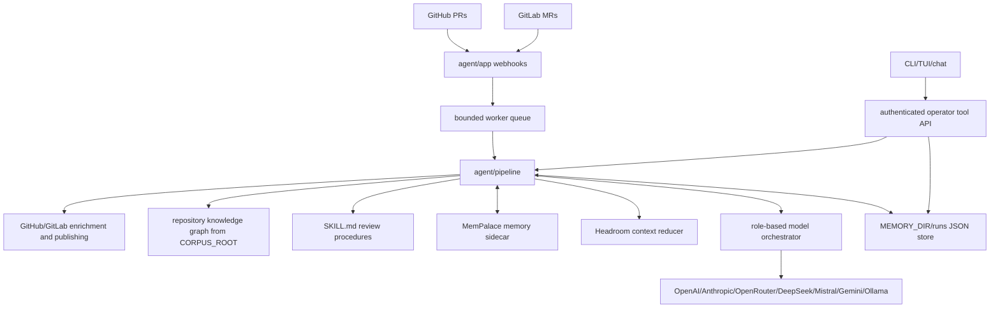
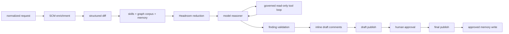

# 7review

7review is a code-review agent for GitHub pull requests and GitLab merge
requests. It receives SCM webhooks, enriches the change with provider metadata,
selects repository knowledge and skills, runs model review, validates findings,
publishes a draft report, waits for human approval, then publishes the final
report and writes approved memory.

## Current Status

7review is usable as a local-first draft review agent. It can receive real
GitHub/GitLab review events, enrich the change, select repository knowledge,
call a model with governed read-only tools, validate findings, publish draft
reports, publish inline draft comments, and keep the final publication behind a
human approval gate.

Implemented and verified:

- GitHub pull request and GitLab merge request webhooks
- GitHub/GitLab enrichment and draft/final publishing adapters
- Bounded webhook worker queue
- Multi-provider model routing with role fallbacks
- OpenAI, Anthropic, OpenRouter, DeepSeek, Mistral, Gemini, Ollama, and
  OpenAI-compatible providers
- Provider-native tool calling for OpenAI-compatible/OpenRouter, Anthropic,
  Gemini, Mistral, and Ollama style responses
- Governed model tool loop for read-only review tools such as changed files,
  diff summary, selected context, merge request metadata, discussions, and
  inline position metadata
- Required Headroom and MemPalace sidecar integrations
- Portable `SKILL.md` review skills
- Required core/provider skill coverage tracking, repair, and deterministic
  fallback coverage for runtime-owned responsibilities
- Generic document graph retrieval for repository knowledge selection
- Finding validation for severity, confidence, changed-file location, and
  addressable changed lines
- Inline draft comment resolution for GitHub/GitLab, including added-file
  fallback when provider diffs do not expose standard unified hunks
- Operator commands for setup, status, run inspection, HIL approval, final
  publish, and streaming chat
- Docker Compose runtime with agent, Headroom bridge, and MemPalace bridge
- Tool execution for run listing, run details, skills, selected context, diff
  summary, provider status, publish status, readiness, config status, HIL
  approval, draft revision, finding suppression, review rerun, final publishing,
  and memory proposal preview

Latest real smoke result:

- Target: GitLab MR `25!19` in the Aïobi Messenger repository
- Provider/model: OpenRouter `openrouter/owl-alpha`
- Context: 24 repository sections, 18 selected skills, 1 changed file
- Agentic loop: model requested `get_changed_files`, `get_diff_summary`, and
  `get_merge_request`
- Result: 4 accepted findings, 0 rejected findings, 4 inline comments
  published, 0 skipped, 0 failed
- Skill coverage: 9 covered, 0 errors, 0 warnings

Current operating recommendation: use 7review as an automated draft reviewer
with human-in-the-loop approval. It is not yet intended to auto-publish final
approval comments without engineer review.

## Architecture

7review is split into two planes:

- review plane: webhook intake, SCM enrichment, context selection, model review,
  finding validation, draft publishing, HIL, final publishing, and memory write
- operator plane: authenticated tools, run inspection, context audit, chat, CLI,
  and TUI

System overview:



Review lifecycle:



Repository knowledge is selected by an in-process graph. The graph builds nodes
from split documentation sections, indexes IDs/routes/schemas/entities/components
and terms, creates typed edges such as `requirement_trace`, `constraint_trace`,
`interface_trace`, `data_trace`, `ui_trace`, `ownership_trace`, and `hierarchy`,
then expands only from exact review signals. The selected sections are exposed
with an `evidence_manifest` so operators can see why each section was included.

During model review, the reasoner may request governed read-only tools. The
pipeline executes only the allowlisted tools, records `tool_call_started` and
`tool_call_completed` events, appends tool observations to review context, and
then asks the reasoner for final JSON findings. Write actions remain outside the
reasoner loop and stay behind deterministic validation and HIL gates.

Package map:

- `cmd/7review`: server and operator CLI entrypoint
- `agent/app`: HTTP routes, webhooks, run endpoints, chat streaming, tool
  execution
- `agent/pipeline`: review lifecycle, run store, deterministic gates, report
  rendering
- `agent/review`: normalized request, source, diff, SCM, finding, report, and
  run state
- `agent/tools`: GitHub/GitLab, Headroom, MemPalace, tool catalog, executor
- `agent/llm/providers`: concrete model provider clients
- `agent/orchestrator`: model role routing, fallback chains, streaming
- `agent/skills`: portable `skill-name/SKILL.md` review procedures
- `agent/ui`: Lip Gloss based setup, status, and chat rendering

For the detailed component model, lifecycle boundaries, state model, evidence
graph retrieval, operator surface, and verification commands, see
[`docs/architecture.md`](docs/architecture.md).

## Review Quality And Limits

7review currently optimizes for useful draft review, traceability, and bounded
side effects. It deliberately keeps final publication under human control.

What works well:

- Contract/API/data-model drift detection when repository docs contain stable
  IDs, routes, schemas, and design decisions.
- Provider-native read-only tool use when the model needs SCM or diff metadata.
- Inline draft publishing when findings point to changed, addressable lines.
- Auditability through run timelines, selected context manifests, tool
  observations, provider traces, and draft reports.

Known limits:

- Model quality still varies by provider. In local testing, Gemini free-tier
  quota and malformed output were common operational issues. OpenRouter
  `openrouter/owl-alpha` produced the strongest observed smoke result so far.
- The validator accepts structurally valid findings, but it does not yet fully
  classify finding strength. A model can still overstate speculative concerns
  as findings unless the skill or validator rejects them.
- Findings need better quality bands: confirmed issue, likely issue, review
  note, and question. Only confirmed/high-confidence issues should become
  inline comments by default.
- Positive observations and weak performance speculation should be downgraded
  to notes instead of inline findings.
- Live smoke success proves the pipeline and publishing path, not that every
  model finding is correct.

Planned hardening:

- Add finding strength classification and publish policy.
- Require stronger citation checks for contract/design-backed findings.
- Keep speculative findings in draft summary or human-check sections.
- Build a small benchmark set of known MRs with expected true positives, false
  positives, and missed findings.

## Quick Start

Generate a local environment file:

```sh
go run ./cmd/7review setup
```

Run the test suite:

```sh
go test ./...
```

Start the agent locally after configuring `.env`:

```sh
set -a
. ./.env
set +a
go run ./cmd/7review
```

Check readiness:

```sh
go run ./cmd/7review status --server http://localhost:8080
```

Start the Docker runtime:

```sh
make docker-up
```

Check the running Docker agent:

```sh
make docker-status
```

## Required Configuration

7review requires:

- one SCM target: GitHub or GitLab webhook/API credentials
- one model provider credential or endpoint
- `HEADROOM_URL`
- `MEMPALACE_URL`
- `REVIEW_API_TOKEN`

Common variables:

```sh
LISTEN_ADDR=:8080
REVIEW_API_TOKEN=change-me
ORCHESTRATOR_CONFIG=./orchestrator.yaml
HEADROOM_URL=http://headroom:8787
MEMPALACE_URL=http://mempalace:8788
MEMORY_DIR=./.7review
CORPUS_ROOT=.
WEBHOOK_WORKERS=4
WEBHOOK_QUEUE_SIZE=128
```

GitHub:

```sh
GITHUB_API_URL=https://api.github.com
GITHUB_TOKEN=...
GITHUB_WEBHOOK_SECRET=...
```

GitLab:

```sh
GITLAB_URL=https://gitlab.com
GITLAB_TOKEN=...
GITLAB_WEBHOOK_SECRET=...
```

Model providers:

```sh
ANTHROPIC_API_KEY=...
OPENAI_API_KEY=...
OPENROUTER_API_KEY=...
DEEPSEEK_API_KEY=...
MISTRAL_API_KEY=...
GEMINI_API_KEY=...
OLLAMA_BASE_URL=http://localhost:11434
```

## Webhooks

Routes:

- `POST /webhook/github`
- `POST /webhook/gitlab`
- `POST /webhook`

Webhook handlers verify the configured provider secret and enqueue bounded
background work. Request handlers do not run review work inline.

## Operator Commands

```sh
7review setup
7review status --server http://localhost:8080
7review tui --server http://localhost:8080
7review tui --watch --refresh 5s --server http://localhost:8080
7review runs --server http://localhost:8080
7review run <run-id> --server http://localhost:8080
7review history <run-id> --server http://localhost:8080
7review history <run-id> --type chat_message --limit 20 --server http://localhost:8080
7review chat
7review chat <run-id> --server http://localhost:8080
7review chat --run <run-id> --server http://localhost:8080
# inside run chat: /status, /tools, /providers, /skills, /run, /draft final.md, /approve --report-file final.md
7review approve --run <run-id> --report-file final.md --server http://localhost:8080
7review publish-final --run <run-id> --report-file final.md --server http://localhost:8080
```

`REVIEW_API_TOKEN` is sent as both `Authorization: Bearer ...` and
`X-7review-Token` by the CLI.

## HTTP API

Operator endpoints:

- `GET /health`
- `GET /ready`
- `GET /tools`
- `POST /tools/execute`
- `GET /runs`
- `GET /run?id=<run-id>`
- `POST /chat/stream?run=<run-id>`
- `POST /approve?run=<run-id>`
- `POST /publish/final?run=<run-id>`

Tool executor example:

```sh
curl -H "Authorization: Bearer $REVIEW_API_TOKEN" \
  -H "Content-Type: application/json" \
  -d '{"name":"list_skills"}' \
  http://localhost:8080/tools/execute
```

## Skills

Skills live under `agent/skills/<skill-name>/SKILL.md`.

Each skill uses YAML frontmatter plus Markdown instructions. The loader validates
that the frontmatter `name` matches the directory name, that `name` and
`description` exist, and that the Markdown body is not empty.

Core always-on review skills:

- `methodology-review`
- `project-knowledge`
- `framework-rules-review`
- `traceability-review`

Provider skills activate by SCM:

- `github-merge-api`
- `gitlab-merge-api`

Other skills activate from request text, labels, branches, and changed paths.

## Docker

Compose services:

- `7review`: Go agent
- `headroom`: Headroom bridge
- `mempalace`: MemPalace bridge

Validate Compose configuration:

```sh
make docker-config
```

Common Docker commands:

```sh
make setup
make docker-build
make docker-up
make docker-status
make docker-logs
make docker-tui
make docker-down
```

Parallel review controls:

- `WEBHOOK_WORKERS`: number of PR/MR review jobs the agent may process at once
- `WEBHOOK_QUEUE_SIZE`: accepted webhook backlog

For example, `WEBHOOK_WORKERS=2` lets two webhook review jobs run through the
pipeline concurrently. Model routing itself is controlled by `orchestrator.yaml`
or by `PROVIDER`, `REVIEW_MODEL`, and `SMALL_MODEL` overrides.

Run bridge tests:

```sh
python3 docker/headroom-bridge/app_test.py
python3 docker/mempalace-bridge/app_test.py
```

## Development

Format and test:

```sh
gofmt -w ./cmd/7review ./agent/...
go test ./...
```

Additional verification:

```sh
python3 -m py_compile docker/headroom-bridge/app.py docker/mempalace-bridge/app.py
docker compose config
```
