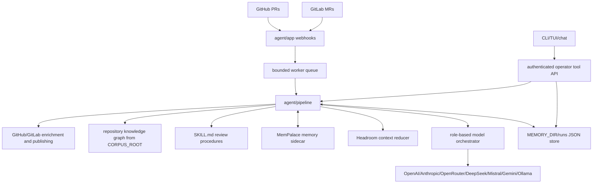
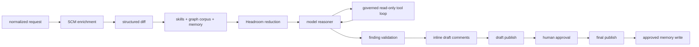
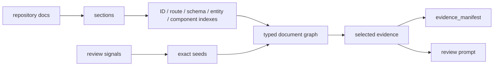

<div align="center">
  
</div>

# 7review


7review is a code-review agent for GitHub pull requests and GitLab merge
requests. It receives SCM webhooks, enriches the change with provider metadata,
selects repository knowledge and skills, runs model review, validates findings,
publishes a draft report, waits for human approval, then publishes the final
report and writes approved memory.

## Current Status

7review is usable as a local-first draft review agent for GitHub pull requests
and GitLab merge requests. Operators can manually request a review for a
specific PR/MR, while SCM webhooks are policy-gated before they enqueue work.
The agent enriches changes, selects repository knowledge, runs model review
with governed read-only tools, validates findings, publishes draft comments,
and keeps final publication behind human approval.

Core capabilities:

- GitHub pull request and GitLab merge request webhooks
- bounded webhook worker queue
- GitHub/GitLab enrichment, draft publishing, and final publishing
- multi-provider model routing with role fallbacks
- OpenAI, Anthropic, OpenRouter, DeepSeek, Mistral, Gemini, Ollama, and
  OpenAI-compatible providers
- provider-native tool calling for OpenAI-compatible/OpenRouter, Anthropic,
  Gemini, Mistral, and Ollama responses
- portable `SKILL.md` review procedures with required core/provider coverage
- generic document graph retrieval for repository knowledge selection
- deterministic finding validation and inline draft comment publishing
- Docker Compose runtime with agent, Headroom bridge, and MemPalace bridge
- operator CLI/TUI/chat for setup, status, run inspection, approval, reruns,
  final publishing, and memory review
- authenticated manual review trigger through CLI or `/tools/execute`

Current operating recommendation: use 7review as an automated draft reviewer
with human-in-the-loop approval. It is not yet intended to auto-publish final
approval comments without engineer review.

## Architecture

7review is split into two planes:

- review plane: webhook intake, SCM enrichment, context selection, model review,
  finding validation, draft publishing, HIL, final publishing, and memory write
- operator plane: authenticated tools, run inspection, context audit, chat, CLI,
  and TUI

System overview:



Review lifecycle:



Repository knowledge is selected by an in-process document graph:



The graph connects requirements, contracts, APIs, data models, design docs,
ownership docs, and rules through typed trace edges. Retrieval expands only from
exact review signals and records why each section was selected in the
`evidence_manifest`.

During model review, the reasoner may request governed read-only tools. The
pipeline executes only the allowlisted tools, records `tool_call_started` and
`tool_call_completed` events, appends tool observations to review context, and
then asks the reasoner for final JSON findings. Write actions remain outside the
reasoner loop and stay behind deterministic validation and HIL gates.

Package map:

- `cmd/7review`: server and operator CLI entrypoint
- `agent/app`: HTTP routes, webhooks, run endpoints, chat streaming, tool
  execution
- `agent/pipeline`: review lifecycle, run store, deterministic gates, report
  rendering
- `agent/review`: normalized request, source, diff, SCM, finding, report, and
  run state
- `agent/tools`: GitHub/GitLab, Headroom, MemPalace, tool catalog, executor
- `agent/llm/providers`: concrete model provider clients
- `agent/orchestrator`: model role routing, fallback chains, streaming
- `agent/skills`: portable `skill-name/SKILL.md` review procedures
- `agent/ui`: Lip Gloss based setup, status, and chat rendering

For the detailed component model, lifecycle boundaries, state model, evidence
graph retrieval, operator surface, and verification commands, see
[`docs/architecture.md`](docs/architecture.md).

For current verification state, live smoke coverage, and known review-quality
limits, see [`docs/status.md`](docs/status.md).

The web documentation site lives in [`site/`](site). It is built with
Docusaurus, includes English and French operator docs, and is configured for
GitHub Pages at `/7review/`. Before the first Pages deployment, configure the
repository once in GitHub: **Settings → Pages → Build and deployment → Source:
GitHub Actions**. The workflow can deploy with `GITHUB_TOKEN`, but GitHub may
block automatic Pages site creation with `Resource not accessible by
integration`.

## Quick Start

Generate a local environment file:

```sh
go run ./cmd/7review setup
```

Run the test suite:

```sh
go test ./...
```

Start the agent locally after configuring `.env`:

```sh
set -a
. ./.env
set +a
go run ./cmd/7review
```

Check readiness:

```sh
go run ./cmd/7review status --server http://localhost:8080
```

Start the Docker runtime:

```sh
make docker-up
```

Check the running Docker agent:

```sh
make docker-status
```

Run the documentation site locally:

```sh
make site-install
make site-dev
```

Manually enqueue one review:

```sh
go run ./cmd/7review review gitlab --project 25 --mr 19 --server http://localhost:8080
go run ./cmd/7review review github --repo owner/repo --pr 7 --server http://localhost:8080
```

## Required Configuration

7review requires:

- one SCM target: GitHub or GitLab webhook/API credentials
- one model provider credential or endpoint
- `HEADROOM_URL`
- `MEMPALACE_URL`
- `REVIEW_API_TOKEN`

Common variables:

```sh
LISTEN_ADDR=:8080
REVIEW_API_TOKEN=change-me
ORCHESTRATOR_CONFIG=./orchestrator.yaml
HEADROOM_URL=http://headroom:8787
MEMPALACE_URL=http://mempalace:8788
MEMORY_DIR=./.7review
CORPUS_ROOT=.
WEBHOOK_WORKERS=4
WEBHOOK_QUEUE_SIZE=128
WEBHOOK_REVIEW_MODE=manual_first
REVIEW_LABEL_INCLUDE=7review,ready-for-review
REVIEW_LABEL_EXCLUDE=no-review,wip,draft
```

Webhook review modes:

- `manual_first`: default; webhook events enqueue review only when include
  policy matches.
- `auto`: webhook events enqueue review unless explicit excludes or allowlists
  reject them.
- `off`: valid webhook events are accepted but ignored by review policy.

GitHub:

```sh
GITHUB_API_URL=https://api.github.com
GITHUB_TOKEN=...
GITHUB_WEBHOOK_SECRET=...
```

GitLab:

```sh
GITLAB_URL=https://gitlab.com
GITLAB_TOKEN=...
GITLAB_WEBHOOK_SECRET=...
```

Model providers:

```sh
ANTHROPIC_API_KEY=...
OPENAI_API_KEY=...
OPENROUTER_API_KEY=...
DEEPSEEK_API_KEY=...
MISTRAL_API_KEY=...
GEMINI_API_KEY=...
OLLAMA_BASE_URL=http://localhost:11434
```

## Webhooks

Routes:

- `POST /webhook/github`
- `POST /webhook/gitlab`
- `POST /webhook`

Webhook handlers verify the configured provider secret and enqueue bounded
background work. Request handlers do not run review work inline.

## Operator Commands

```sh
7review setup
7review status --server http://localhost:8080
7review tui --server http://localhost:8080
7review tui --watch --refresh 5s --server http://localhost:8080
7review runs --server http://localhost:8080
7review run <run-id> --server http://localhost:8080
7review history <run-id> --server http://localhost:8080
7review history <run-id> --type chat_message --limit 20 --server http://localhost:8080
7review chat
7review chat <run-id> --server http://localhost:8080
7review chat --run <run-id> --server http://localhost:8080
# inside run chat: /status, /tools, /providers, /skills, /run, /draft final.md, /approve --report-file final.md
7review approve --run <run-id> --report-file final.md --server http://localhost:8080
7review publish-final --run <run-id> --report-file final.md --server http://localhost:8080
```

`REVIEW_API_TOKEN` is sent as both `Authorization: Bearer ...` and
`X-7review-Token` by the CLI.

## HTTP API

Operator endpoints:

- `GET /health`
- `GET /ready`
- `GET /tools`
- `POST /tools/execute`
- `GET /runs`
- `GET /run?id=<run-id>`
- `POST /chat/stream?run=<run-id>`
- `POST /approve?run=<run-id>`
- `POST /publish/final?run=<run-id>`

Tool executor example:

```sh
curl -H "Authorization: Bearer $REVIEW_API_TOKEN" \
  -H "Content-Type: application/json" \
  -d '{"name":"list_skills"}' \
  http://localhost:8080/tools/execute
```

## Skills

Skills live under `agent/skills/<skill-name>/SKILL.md`.

Each skill uses YAML frontmatter plus Markdown instructions. The loader validates
that the frontmatter `name` matches the directory name, that `name` and
`description` exist, and that the Markdown body is not empty.

Core always-on review skills:

- `methodology-review`
- `project-knowledge`
- `framework-rules-review`
- `traceability-review`

Provider skills activate by SCM:

- `github-merge-api`
- `gitlab-merge-api`

Other skills activate from request text, labels, branches, and changed paths.

## Docker

Compose services:

- `7review`: Go agent
- `headroom`: Headroom bridge
- `mempalace`: MemPalace bridge

Validate Compose configuration:

```sh
make docker-config
```

Common Docker commands:

```sh
make setup
make docker-build
make docker-up
make docker-status
make docker-logs
make docker-tui
make docker-down
```

Parallel review controls:

- `WEBHOOK_WORKERS`: number of PR/MR review jobs the agent may process at once
- `WEBHOOK_QUEUE_SIZE`: accepted webhook backlog

For example, `WEBHOOK_WORKERS=2` lets two webhook review jobs run through the
pipeline concurrently. Model routing itself is controlled by `orchestrator.yaml`
or by `PROVIDER`, `REVIEW_MODEL`, and `SMALL_MODEL` overrides.

Run bridge tests:

```sh
python3 docker/headroom-bridge/app_test.py
python3 docker/mempalace-bridge/app_test.py
```

## Development

Format and test:

```sh
gofmt -w ./cmd/7review ./agent/...
go test ./...
```

Additional verification:

```sh
python3 -m py_compile docker/headroom-bridge/app.py docker/mempalace-bridge/app.py
docker compose config
```
