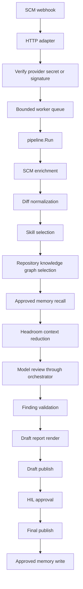
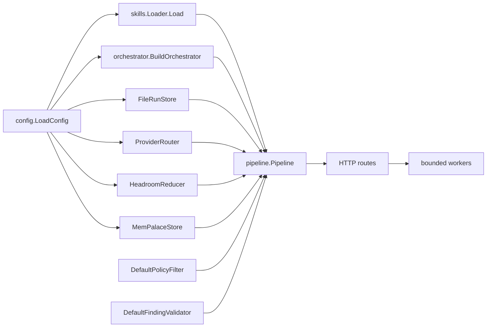
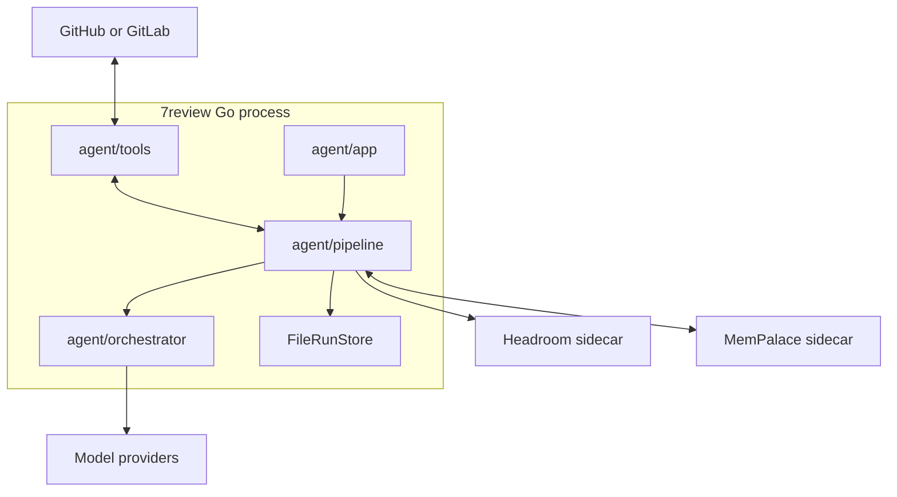
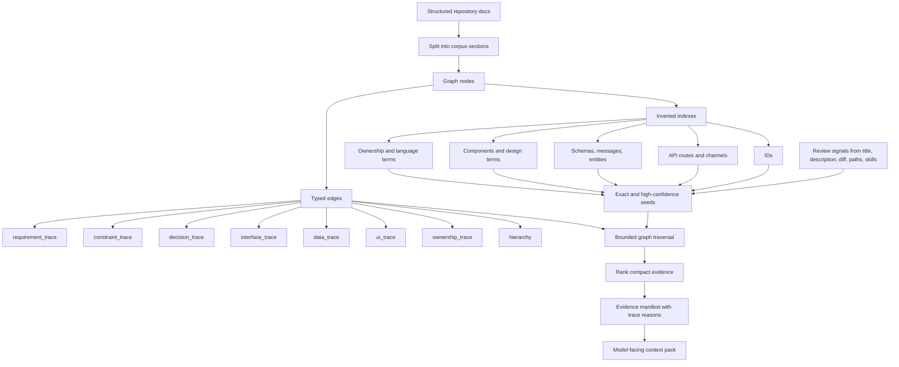
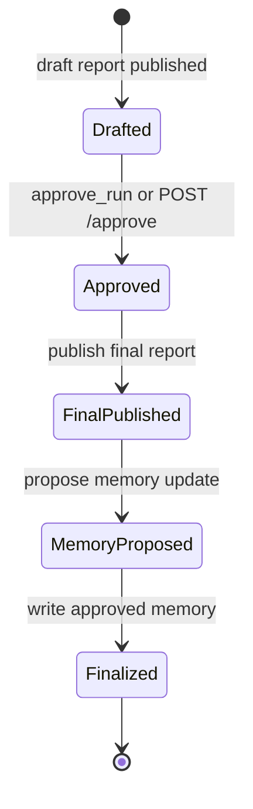

# 7review Architecture

7review is a webhook-driven review service. The Go process owns request
normalization, state transitions, deterministic gates, model orchestration, and
publishing decisions. Models propose review content; they do not own lifecycle
state, approval, memory writes, or SCM side effects.

## Runtime Shape



The central packages are:

- `cmd/7review`: CLI entrypoint, operator commands, TUI, and operator API
  client DTOs.
- `agent/app`: HTTP server, webhook handlers, worker queue, readiness, run
  endpoints, chat streaming, HIL endpoints, and tool execution.
- `agent/pipeline`: review lifecycle, run stores, context selection, finding
  validation, report rendering, draft/final transitions, and memory write gates.
- `agent/review`: provider-neutral request, SCM, diff, source evidence, finding,
  report, and run context types.
- `agent/tools`: GitHub/GitLab adapters, provider router, Headroom and MemPalace
  clients, model-facing tool catalog, and tool executor contracts.
- `agent/orchestrator`: role-based model routing, provider fallback chains,
  parallel reasoner fan-out, and streaming formatter/chat calls.
- `agent/llm/providers`: concrete provider clients for OpenAI-compatible
  services, Anthropic, OpenRouter, DeepSeek, Mistral, Gemini, and Ollama.
- `agent/skills`: portable review procedures loaded from `SKILL.md`.
- `agent/ui`: terminal rendering for status, setup, chat, and the live TUI.

## Server Composition

`agent/app.NewServer` loads configuration, loads skills, builds the model
orchestrator, creates a file-backed run store, wires provider adapters, and then
starts bounded workers.



Webhook handlers never run review work inline. They normalize the provider
payload into `review.Request`, claim the delivery ID to suppress duplicates, and
enqueue a `workItem`. Workers call `pipeline.Run` with a bounded job timeout.

Operator endpoints are protected by `REVIEW_API_TOKEN`:

- `GET /ready`
- `GET /tools`
- `POST /tools/execute`
- `GET /runs`
- `GET /run?id=<run-id>`
- `POST /chat/stream?run=<run-id>`
- `POST /approve?run=<run-id>`
- `POST /publish/final?run=<run-id>`

## Review Pipeline

`pipeline.Pipeline.Run` is the authoritative automated lifecycle.

1. Start a run in `RunStore`.
2. Record `webhook_received`.
3. Enrich from SCM through `tools.SCM`.
4. Normalize changed files into `review.StructuredDiff`.
5. Select skills from request text, labels, branches, and changed paths.
6. Select repository knowledge from `CORPUS_ROOT`.
7. Recall approved memory through `MemoryStore`.
8. Apply policy and reduce assembled context through `ContextReducer`.
9. Call the orchestrator reasoner role over diff batches.
10. Parse model JSON findings.
11. Validate findings with `FindingValidator`.
12. Render a draft report.
13. Publish the draft through `tools.Publisher`.
14. Save context and mark the run `drafted`.

The pipeline records trace events for each major stage. These events are
persisted on the run and surfaced through run inspection tools.

## State And Persistence

`RunStore` is the pipeline persistence boundary:

```go
type RunStore interface {
    Start(context.Context, review.Request) (*Run, error)
    Update(context.Context, string, RunStatus, error) error
    SaveContext(context.Context, string, *review.Context) error
    AppendEvent(context.Context, string, RunEvent) error
    Get(context.Context, string) (*Run, error)
    List(context.Context) ([]Run, error)
}
```

Production uses `FileRunStore` under `MEMORY_DIR/runs`. Tests can use
`MemoryRunStore`. Run IDs are provider-neutral and derived from project and
change identity, for example:

```text
owner/repo!17
42!7
```

Persisted run state includes:

- normalized request
- status and error
- trace/chat events
- selected review context
- draft and final reports
- HIL approval state
- validated findings
- source URL

## External Boundaries

SCM adapters implement two contracts:

```go
type SCM interface {
    Enrich(context.Context, review.Request) (*review.SCMContext, error)
}

type Publisher interface {
    PublishDraft(context.Context, *review.SCMContext, string) error
    PublishFinal(context.Context, *review.SCMContext, string) error
}
```

`tools.ProviderRouter` dispatches both contracts by provider name. GitHub and
GitLab clients provide enrichment plus draft/final publishing.

Headroom and MemPalace are sidecars reached over HTTP:

- `HEADROOM_URL`: context reduction before model review.
- `MEMPALACE_URL`: approved memory recall and post-HIL memory writes.

Production configuration treats these dependencies as required. If a configured
Headroom or MemPalace integration is replaced by a no-op adapter, the pipeline
rejects the run.



## Model Routing

`orchestrator.yaml` maps semantic roles to model/provider chains:

```text
reasoner  -> code review over selected evidence
formatter -> operator chat and draft revision
embedder  -> memory embedding
```

The local configured route is:

```text
reasoner:  deepseek-coder-v2:16b@ollama
fallback:  qwen2.5-coder-7b-16k:latest@ollama

formatter: qwen2.5-coder-7b-16k:latest@ollama
fallback:  qwen2.5-coder:7b-instruct-q4_K_M@ollama

embedder:  nomic-embed-text:latest@ollama
```

The reasoner role uses `CompleteParallel` over diff batches. The formatter role
uses completion or streaming depending on the call path. Every successful model
review records provider/model metadata in the `model_review_completed` trace
event.

## Evidence And Context Selection

Review prompts are assembled from labeled evidence blocks:

- `scm`: provider, project, change, URL, and MR/PR description.
- `diff`: normalized changed-file patches.
- `skill`: selected review procedures from `agent/skills`.
- `repo_knowledge`: selected corpus sections from `CORPUS_ROOT`.
- `approved_memory`: durable memory recalled before review.

Repository knowledge selection is graph-based:

1. Discover and split corpus documents into sections.
2. Build graph nodes from sections.
3. Index IDs, API routes, schemas/messages/channels, components, entities, and
   terms.
4. Build typed edges such as `requirement_trace`, `constraint_trace`,
   `decision_trace`, `interface_trace`, `data_trace`, `ui_trace`,
   `ownership_trace`, and `hierarchy`.
5. Seed retrieval from review signals in request, diff, paths, SCM context, and
   selected skills.
6. Expand only from seeds with bounded traversal.
7. Rank evidence and store an evidence manifest with graph-aware
   `selection_reason` values.



The model-facing prompt contains the selected evidence content, not internal
selection debug prose. Operator tooling can inspect the manifest through
`get_selected_context` or the TUI `/context` command.

## Finding Validation

The model must return JSON findings. The parser accepts raw arrays, an envelope
with `findings`, or JSON fenced blocks. `DefaultFindingValidator` rejects unsafe
or unsupported findings, including:

- duplicate IDs
- invalid severity
- low confidence
- locations outside changed paths

Only accepted findings appear in the draft and final reports.

## HIL And Publishing

The draft path is automatic. Final publication and memory writes require an
explicit HIL action:



Chat messages and model output cannot approve a run. Approval is a structured
tool/API/CLI action with an operator-provided report.

## Operator Surface

The terminal operator surface is split into:

- `cmd/7review/operator`: operator API DTOs, HTTP client, slash command
  metadata, and compact renderers.
- `cmd/7review/operator_handlers.go`: registered slash command handlers.
- `cmd/7review/tui.go`: Bubble Tea model/update/view behavior.
- `agent/ui`: reusable rendering primitives.

Slash commands are metadata-driven and dispatched through registered handlers:

```text
/status
/providers
/config
/skills
/tools
/sessions
/run
/history
/diff
/context
/draft
/memory
/approve
/publish-final
```

`/context` displays selected review context and graph trace reasons so an
operator can verify why evidence was included before discussing or approving a
review.

## Verification

Default deterministic suite:

```sh
GOCACHE=/tmp/7review-gocache go test ./...
```

Live local model smoke for the complete review pipeline:

```sh
RUN_LIVE_SMOKE=1 \
OLLAMA_BASE_URL=http://127.0.0.1:11434 \
ORCHESTRATOR_CONFIG=./orchestrator.yaml \
GOCACHE=/tmp/7review-gocache \
go test -tags live_smoke ./agent/pipeline \
  -run TestLiveSmokeReviewPipelineWithConfiguredOllamaModels \
  -count=1 -v
```

The live smoke uses fake SCM/publisher/memory boundaries to avoid external side
effects, but it runs the production pipeline and calls the configured Ollama
reasoner model. It asserts that the run reaches draft publication and records
`ollama/deepseek-coder-v2:16b` in the `model_review_completed` trace.
