# Architecture

7review has two planes:

- review plane: webhook intake, SCM enrichment, context selection, model review,
  validation, draft publishing, HIL, final publishing, memory write
- operator plane: authenticated tools, CLI, TUI, chat, run inspection

## Review lifecycle

```mermaid
flowchart LR
    Request[normalized request] --> Enrich[SCM enrichment]
    Enrich --> Diff[structured diff]
    Diff --> Context[skills + corpus + memory]
    Context --> Reduce[Headroom reduction]
    Reduce --> Review[model reasoner]
    Review --> Validate[finding validation]
    Validate --> Inline[inline draft comments]
    Inline --> Draft[draft publish]
    Draft --> HIL[human approval]
    HIL --> Final[final publish]
    Final --> Memory[approved memory write]
```

## Packages

| Package | Responsibility |
| --- | --- |
| `cmd/7review` | server and operator CLI entrypoint |
| `agent/app` | HTTP routes, webhooks, workers, tools, chat |
| `agent/pipeline` | review lifecycle and deterministic gates |
| `agent/review` | provider-neutral review domain types |
| `agent/tools` | GitHub, GitLab, Headroom, MemPalace, tool executor |
| `agent/orchestrator` | model role routing and fallbacks |
| `agent/llm/providers` | concrete model provider clients |
| `agent/skills` | portable review skills |

## Queue boundary

Webhook handlers and manual triggers never run review work inline. They enqueue
bounded `workItem` jobs. Workers run with `WEBHOOK_JOB_TIMEOUT_MS`.

## State

Run state, draft reports, HIL approval state, final reports, and selected source
context are persisted under `MEMORY_DIR/runs`.
