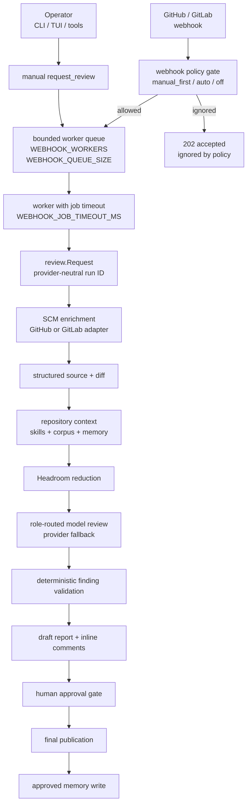

# Architecture

7review is an operator-controlled review agent. It does not treat webhooks as
permission to review every change. A webhook or a manual command only creates a
normalized request; policy, queue limits, SCM enrichment, context selection,
model routing, validation, draft publishing, and human approval stay inside the
same runtime path.

## System boundaries

| Boundary | 7review owns | External system |
| --- | --- | --- |
| Operator control | CLI, TUI, authenticated tools, run inspection | The human operator who decides which PR or MR should be reviewed |
| SCM access | Normalized request, provider routing, diff and metadata shape | GitHub or GitLab APIs and webhooks |
| Review execution | Queue, workers, pipeline state, validation, draft output | Model providers reached through configured LLM clients |
| Context services | Calls to Headroom and MemPalace clients | Headroom and MemPalace sidecars |
| Publication | Draft comments, final publish command, approval state | GitHub PR or GitLab MR review surfaces |

The important engineering decision is that intake is thin. HTTP handlers
authenticate, normalize, apply policy, and enqueue. Workers execute the review
pipeline under bounded concurrency.

## Runtime map

:::info Runtime map

:::

## Package responsibilities

| Package | Responsibility |
| --- | --- |
| `cmd/7review` | CLI entrypoint, server startup, operator commands, setup flow |
| `agent/config` | Environment parsing for providers, queue limits, webhook policy, memory paths |
| `agent/app` | HTTP routes, webhook handlers, tool execution, readiness, worker pool wiring |
| `agent/review` | Provider-neutral domain types: request, source, diff, findings, report state |
| `agent/pipeline` | Review lifecycle orchestration, deterministic gates, run store, memory interfaces |
| `agent/tools` | GitHub, GitLab, Headroom, MemPalace, tool catalog, provider routing |
| `agent/orchestrator` | Model role selection, fallback behavior, role concurrency settings |
| `agent/llm` | Concrete LLM clients and request/response adaptation |
| `agent/skills` | Portable review skills used as review-time context |

The package split keeps provider-specific API details outside the pipeline. The
pipeline should work from normalized review types, while `agent/tools` absorbs
the differences between GitHub and GitLab.

## Request lifecycle

1. A manual command or authenticated tool call creates an exact request:
   `github owner/repo#pr` or `gitlab project!mr`.
2. A webhook creates the same normalized request only when the policy gate
   allows automation.
3. The app layer checks whether the run is already queued or running.
4. The request enters the bounded worker queue.
5. A worker enriches the request from SCM, builds source and diff context, then
   asks Headroom and MemPalace for the useful review context.
6. The orchestrator routes model calls according to configured roles and
   fallback rules.
7. Findings are validated before publication so malformed or stale comments are
   filtered deterministically.
8. 7review publishes draft output and waits for explicit human approval before
   final publication and memory write.

## Queue and concurrency

Webhook and manual triggers share the same queue because they produce the same
kind of work. This prevents a webhook burst from bypassing the limits used by
operator-triggered reviews.

| Setting | Purpose |
| --- | --- |
| `WEBHOOK_WORKERS` | Number of concurrent review jobs executed by the server |
| `WEBHOOK_QUEUE_SIZE` | Maximum accepted backlog before new work is rejected |
| `WEBHOOK_JOB_TIMEOUT_MS` | Maximum wall-clock time for one queued review job |

Duplicate handling happens before enqueue. If the same provider-neutral run ID
is already queued or running, the request is rejected with a clear conflict. If
a previous run has completed or failed, a manual trigger can create a fresh
rerun.

## State model

Run data is stored under `MEMORY_DIR/runs`. The stored state is intentionally
review-oriented rather than transport-oriented:

| State | Why it exists |
| --- | --- |
| Run status | Lets operators distinguish queued, running, failed, completed, and approval states |
| Source context | Keeps the reviewed source and selected context inspectable after the run |
| Draft report | Preserves the model output that was prepared for publication |
| Inline comments | Tracks confirmed line-level comments before final approval |
| Approval state | Records whether final publication is still blocked by the human gate |
| Approved memory | Writes durable learning only after accepted review output |

This is still an in-process queue. For horizontal production scaling, add a
durable external queue before running multiple server instances.

## Deterministic gates

The agentic part of 7review is the context selection and model review, but the
runtime keeps deterministic gates around it:

- webhook policy decides whether automation may enqueue work
- queue capacity prevents unbounded request fan-out
- SCM enrichment verifies the target change still exists
- finding validation rejects comments that do not match the current diff
- human approval blocks final publication
- approved memory is written only after accepted review output

These gates make the service operable: the model can reason over code, while
the application remains explicit about when work starts and when output becomes
final.

## Extension points

Add new behavior at the narrowest boundary:

| Extension | Preferred location |
| --- | --- |
| New SCM provider | `agent/tools` adapter plus normalized `review.Request` fields |
| New model provider | `agent/llm` client plus orchestrator configuration |
| New review gate | `agent/pipeline`, where source, diff, and findings are available |
| New operator action | `agent/tools` catalog, then expose it through CLI or TUI |
| New deployment mode | Docker or runtime configuration without changing pipeline semantics |

The goal is to keep the review pipeline stable while changing provider,
operator, or deployment surfaces independently.
