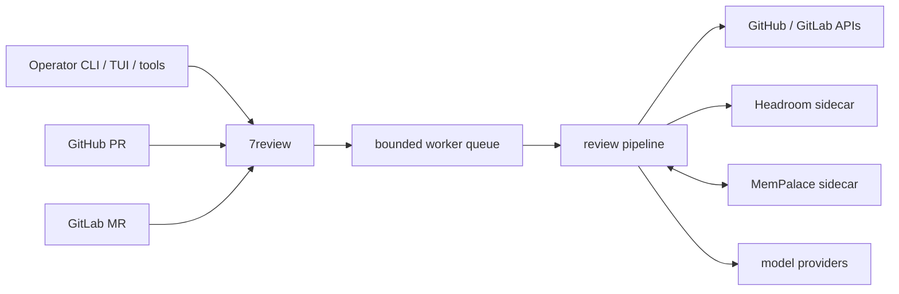

# Overview

7review is a Go review service for GitHub pull requests and GitLab merge
requests. It creates draft review output, publishes draft comments, waits for
human approval, then publishes final output and writes approved memory.

The operator controls when a review starts:

- manual review requests target one PR or MR exactly
- webhook review is policy-gated before it enters the worker queue
- final publication remains human-approved

## Runtime shape

## Default operating model

The default webhook mode is `manual_first`. Valid webhooks are accepted, but
they only enqueue a review when include policy matches. Operators can always
request a review directly through the authenticated tool API or CLI.

## Main operator paths

| Task | Start here |
| --- | --- |
| Bring up a local agent | [Quick Start](./quick-start) |
| Configure required environment | [Configuration](./configuration.md) |
| Review one PR or MR | [Manual Reviews](./manual-reviews) |
| Gate webhook automation | [Webhook Policy](./webhook-policy.md) |
| Run with sidecars | [Docker Deployment](./docker.md) |
| Diagnose a failed run | [Troubleshooting](./troubleshooting.md) |
