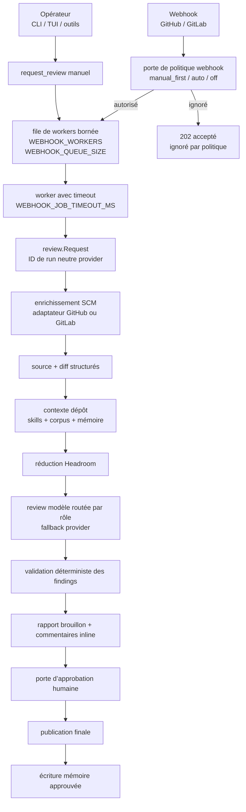

# Architecture

7review est un agent de review contrôlé par l’opérateur. Un webhook n’est pas
une autorisation implicite de reviewer tous les changements. Un webhook ou une
commande manuelle crée seulement une requête normalisée ; la politique, la file
bornée, l’enrichissement SCM, la sélection de contexte, le routage modèle, la
validation, la publication brouillon et l’approbation humaine restent dans le
même chemin runtime.

## Frontières du système

| Frontière | Ce que 7review possède | Système externe |
| --- | --- | --- |
| Contrôle opérateur | CLI, TUI, outils authentifiés, inspection des runs | L’humain qui décide quelle PR ou MR doit être reviewée |
| Accès SCM | Requête normalisée, routage provider, forme du diff et des métadonnées | APIs et webhooks GitHub ou GitLab |
| Exécution review | File, workers, état pipeline, validation, sortie brouillon | Providers modèle appelés par les clients LLM configurés |
| Services de contexte | Clients Headroom et MemPalace | Sidecars Headroom et MemPalace |
| Publication | Commentaires brouillon, publication finale, état d’approbation | Surfaces de review GitHub PR ou GitLab MR |

La décision d’architecture importante est que l’intake reste mince. Les
handlers HTTP authentifient, normalisent, appliquent la politique et mettent en
file. Les workers exécutent le pipeline de review sous concurrence bornée.

## Carte runtime

:::info Carte runtime

:::

## Responsabilités par package

| Package | Responsabilité |
| --- | --- |
| `cmd/7review` | Entrée CLI, démarrage serveur, commandes opérateur, configuration initiale |
| `agent/config` | Parsing des variables d’environnement : providers, file, politique webhook, chemins mémoire |
| `agent/app` | Routes HTTP, handlers webhook, exécution des outils, readiness, wiring du pool workers |
| `agent/review` | Types domaine neutres provider : requête, source, diff, findings, état rapport |
| `agent/pipeline` | Orchestration du cycle review, portes déterministes, run store, interfaces mémoire |
| `agent/tools` | GitHub, GitLab, Headroom, MemPalace, catalogue d’outils, routage provider |
| `agent/orchestrator` | Sélection des rôles modèle, fallback, réglages de concurrence par rôle |
| `agent/llm` | Clients LLM concrets et adaptation requête/réponse |
| `agent/skills` | Skills portables injectés comme contexte de review |

Cette séparation garde les détails d’API GitHub et GitLab hors du pipeline. Le
pipeline travaille avec les types normalisés de `agent/review`, tandis que
`agent/tools` absorbe les différences entre providers.

## Cycle d’une requête

1. Une commande manuelle ou un appel outil authentifié crée une cible exacte :
   `github owner/repo#pr` ou `gitlab project!mr`.
2. Un webhook crée la même requête normalisée seulement si la politique autorise
   l’automatisation.
3. La couche app vérifie si le run est déjà en file ou en cours.
4. La requête entre dans la file de workers bornée.
5. Un worker enrichit la requête depuis le SCM, construit la source et le diff,
   puis demande à Headroom et MemPalace le contexte utile à la review.
6. L’orchestrateur route les appels modèle selon les rôles et les règles de
   fallback configurés.
7. Les findings sont validés avant publication pour filtrer les commentaires
   mal formés ou détachés du diff courant.
8. 7review publie une sortie brouillon et attend l’approbation humaine explicite
   avant la publication finale et l’écriture mémoire.

## File et concurrence

Les déclenchements webhook et manuels partagent la même file parce qu’ils
produisent le même type de travail. Un pic de webhooks ne peut donc pas
contourner les limites utilisées par les reviews déclenchées par l’opérateur.

| Réglage | Rôle |
| --- | --- |
| `WEBHOOK_WORKERS` | Nombre de jobs de review exécutés en parallèle |
| `WEBHOOK_QUEUE_SIZE` | Taille maximale du backlog accepté avant rejet |
| `WEBHOOK_JOB_TIMEOUT_MS` | Durée maximale d’un job de review |

La déduplication se fait avant la mise en file. Si le même ID de run neutre
provider est déjà en file ou en cours, la requête est rejetée avec un conflit
clair. Si un run précédent est terminé ou en échec, un déclenchement manuel peut
créer un nouveau rerun.

## Modèle d’état

Les données de run sont stockées sous `MEMORY_DIR/runs`. L’état stocké décrit la
review, pas le transport HTTP :

| État | Pourquoi il existe |
| --- | --- |
| Statut du run | Distinguer queued, running, failed, completed et les états d’approbation |
| Contexte source | Garder la source reviewée et le contexte sélectionné inspectables |
| Rapport brouillon | Préserver la sortie modèle préparée pour publication |
| Commentaires inline | Suivre les commentaires ligne par ligne avant approbation finale |
| État d’approbation | Savoir si la publication finale est encore bloquée par l’humain |
| Mémoire approuvée | Écrire l’apprentissage durable seulement après sortie acceptée |

La file reste en mémoire dans ce passage. Pour scaler horizontalement en
production, ajoute une file externe durable avant de lancer plusieurs instances.

## Portes déterministes

La partie agentique de 7review est la sélection de contexte et la review modèle,
mais le runtime l’encadre avec des portes déterministes :

- la politique webhook décide si l’automatisation peut mettre en file
- la capacité de file empêche le fan-out non borné
- l’enrichissement SCM vérifie que le changement cible existe encore
- la validation des findings rejette les commentaires hors diff courant
- l’approbation humaine bloque la publication finale
- la mémoire approuvée n’est écrite qu’après une sortie acceptée

Ces portes rendent le service opérable : le modèle raisonne sur le code, mais
l’application reste explicite sur le démarrage du travail et sur le moment où la
sortie devient finale.

## Points d’extension

Ajoute les évolutions à la frontière la plus étroite :

| Extension | Emplacement préféré |
| --- | --- |
| Nouveau provider SCM | Adaptateur `agent/tools` plus champs normalisés dans `review.Request` |
| Nouveau provider modèle | Client `agent/llm` plus configuration orchestrateur |
| Nouvelle porte de review | `agent/pipeline`, où source, diff et findings sont disponibles |
| Nouvelle action opérateur | Catalogue `agent/tools`, puis exposition CLI ou TUI |
| Nouveau mode de déploiement | Docker ou configuration runtime sans changer la sémantique pipeline |

L’objectif est de garder le pipeline de review stable tout en faisant évoluer
indépendamment les surfaces provider, opérateur ou déploiement.
