# Architecture

7review sépare :

- le plan review : webhooks, enrichissement SCM, contexte, modèle,
  validation, brouillon, HIL, publication finale, mémoire
- le plan opérateur : outils authentifiés, CLI, TUI, chat, inspection des runs

```mermaid
flowchart LR
    Request[requete normalisee] --> Enrich[enrichissement SCM]
    Enrich --> Diff[diff structure]
    Diff --> Context[skills + corpus + memoire]
    Context --> Reduce[reduction Headroom]
    Reduce --> Review[modele reasoner]
    Review --> Validate[validation findings]
    Validate --> Draft[publication brouillon]
    Draft --> HIL[approbation humaine]
    HIL --> Final[publication finale]
    Final --> Memory[memoire approuvee]
```

Les handlers webhook et les déclenchements manuels ne font pas le travail en
ligne. Ils envoient un job dans la file bornée.
