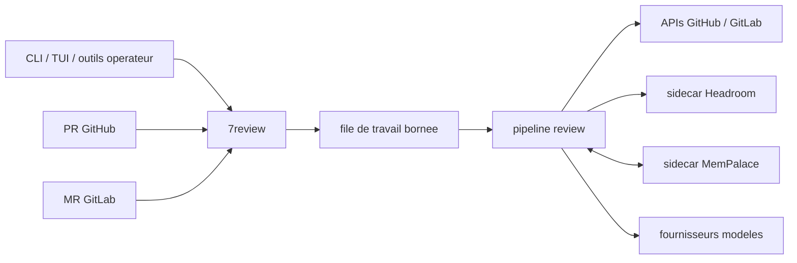

# Vue d'ensemble

7review est un service Go de review pour les pull requests GitHub et les merge
requests GitLab. Il produit une review brouillon, publie des commentaires
brouillon, attend l'approbation humaine, puis publie la version finale et écrit
la mémoire approuvée.

L'opérateur contrôle le démarrage :

- les reviews manuelles ciblent une PR ou MR précise
- les webhooks sont filtrés par politique avant la file de travail
- la publication finale reste approuvée par un humain

## Forme runtime

## Mode par défaut

Le mode webhook par défaut est `manual_first`. Les webhooks valides sont
acceptés, mais ils ne lancent une review que si la politique d'inclusion
correspond. Un opérateur peut toujours déclencher une review via l'API outil ou
la CLI authentifiée.
